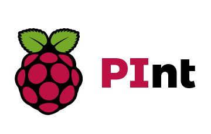
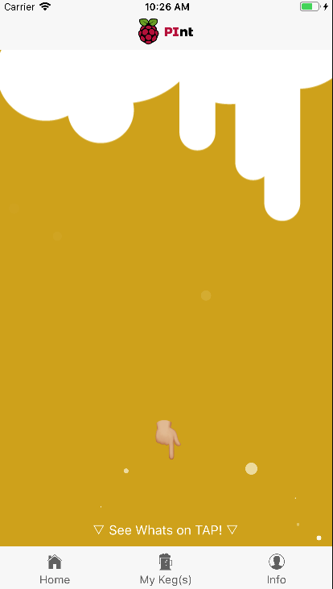
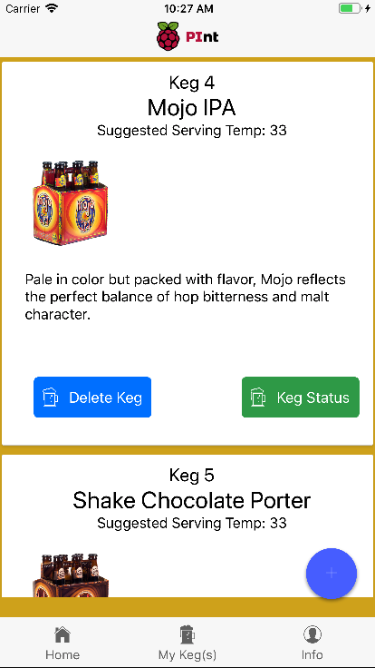
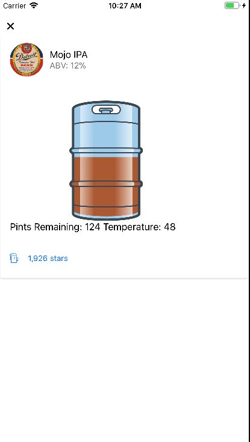
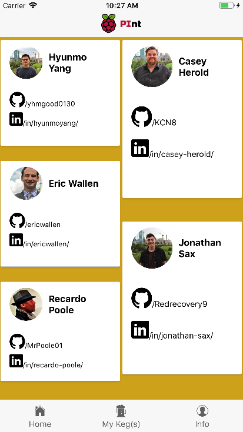
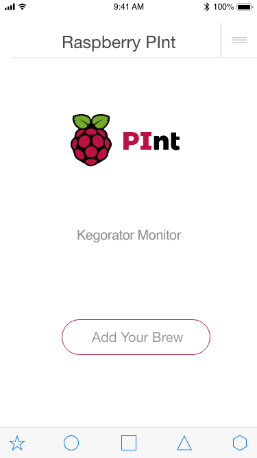

# Raspberry-Pint
A mobile app that monitors the level of your keg, temperature, and will show details of the beer you're drinking. With just a click you can see all the details of the beer or you can see what the temperature of you keg is at as well as how full your keg is.

## API
- https://github.com/KCN8/Raspberry-Pint-RPI-Software
- https://github.com/KCN8/Raspberry-Pint-API

## Future Plans
- HardWare to work
- Polish Appearance

## Built With
- HardWare
  - Raspberry pi
  - Flow Meter
  - Thermometer
- SoftWare
  - JavaScript
  - Node.js
  - React Native
  - NativeBase
  - Knex
  - Heroku
  - Expo
- Blood
- Sweat
- Tears

## Screenshots
 
 

## Mockups
 
 
